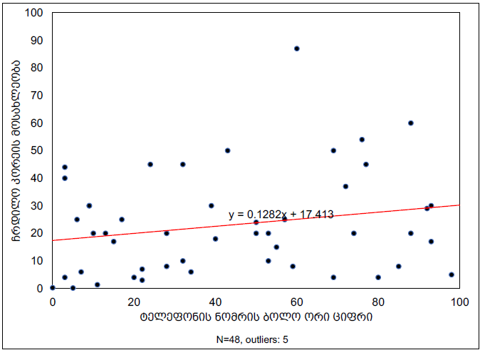

RMSS: First Meeting 

Research Methodology in Social Sciences
========================================================
author: Dr. David Sichinava
date: September 1, 2018
autosize: true
transition: none
css: css/style.css
font-family: 'BPG_upper'
First Meeting

Today's plan
========================================================
incremental: true

- Research methods, what are we up to?
  - Logistics, assessments, etc.
- Lecture: Science, Theory, Knowledge, and... Black Swans

Class logistics:
========================================================
incremental: false

Last weeks were quite hectic at IBSU, therefore starting from the next week we'll coordinate in terms of SMART. All your books, grades, assignments will be posted there. We will be communicating through SMART as well.

What are we up to? Class structure 
========================================================
incremental: false

  Lecture
 

Class structure: 
========================================================
incremental: false

  Lecture
 
 Seminar

Books (available through SMART): 
========================================================
incremental: false

 Literature
- Kellstedt, P.M., and G.D. Whitten. 2013. Political Science Research. (2nd ed.). 

	
Assessment: 
========================================================
incremental: false

 
[Source:](https://www.facebook.com/Maghlive/photos/a.212470299086939.1073741827.212465039087465/404816289852338/?type=1&theater)

Assessment: 
========================================================
incremental: false

- Participation (10%)
- Research paper (20%)
- Midterm (20%)
- Presentation (10%)
- Final exam (40%)

Before we start...
====================================
On a piece of paper write down last TWO digits of your phone number

Why should we study research methods?
====================================

> In God we trust. Others bring data

Knowledge models
====================================

* Autoritative
* Mystic
* Rationalist

Sources of knowledge
====================================

* Personal experience
* Common sense
* Experts and authorities
* Media
* Ideological beliefs
* Tradition

Humans are error-prone...
====================================

Humans are error-prone...
====================================

Humans are error-prone...
====================================
* Inaccurate observations
* Overgeneralization
* Selective observation
* Illogical reasoning

Finally, about Black Swans
====================================

...and on revolutions
====================================

Two foreign words
====================================
incremental: true

> Ontology: a set of concepts and categories in a subject area or domain that shows their properties and the relations between them.

> Epistemology: the theory of knowledge, especially with regard to its methods, validity, and scope, and the distinction between justified belief and opinion.

The nature of research
====================================

Scientific reasoning
====================================
* Idiographic: relating to the study or discovery of particular scientific facts and processes, as distinct from general laws.

* Nomothetic: relating to the study or discovery of general scientific laws

Scientific reasoning
====================================

* Deduction
	+ Universal generalization
	+ Explanation
	+ Usage of formal logic

Scientific explanation
====================================

* Induction
	+ Derives from probabilistic generalization and indicates to trends
	+ We ARE NOT entirely sure in our explanation

Inductive (probabilistic explanation)
====================================
left: 30%

****
<!-- *** -->

Forecasting
====================================
incremental: true
left: 0%

If $X → Y$ and $X$ exists, then the existence of $Y$ is likely

Understanding
====================================
* Interpretation

Epistemology: positivism
========================================================

 

Epistemology: positivism
========================================================
incremental: true

* Objective reality exists, it can be understood and general laws can be derived

* Comte, Durkheim, Bacon, Popper, Talcott-Parsons, Merton, Lasarsfeld...

Epistemology: positivism
========================================================
incremental: true

* Phenomenalism: Only _phenomena_ can be studied scientificaly

* Deductivism: _The goal of theory_ is to create a hypothesis, what in turn needs to be checked

* Inductivism: Knowledge is derived through collecting facts which in turn grounds a theory

Epistemology: interpretativism
========================================================
incremental: true

* Social and natural sciences study different things therefore have different objectives

* Social sciences study a _subjective meaning_ of a phenomenon, not general laws

* Weber (_Verstehen_ - understanding), Husserl, Wittgenstein, Schutz...

Epistemology: interpretativism
========================================================

Recap: epistemology
========================================================

| **Positivism**                                                            | **Interpretativism**                                                                                  |
|----------------------------------------------------------------------------|------------------------------------------------------------------------------------------------------|
| General laws of human behavior                                 | Study informants' in in-depth and empathic manner                    |
| Social sciences should use similar methods to natural science | As we study our subjects through their viewpoint, the logic of natural sciences are not useful |
| Human behavior can be explained through general laws | As humans are complex subjects, it is impossible to derive general laws |

Quantitative versus Qualitative
========================================================

|			 | **Quantitative**                                                            | **თვისებრივი**                                                                                  |
|------------|----------------------------------------------------------------------------|------------------------------------------------------------------------------------------------------|
| The role of theory| Deductivism: theory testing | Inductivism: theory generation |
| Epistemology:| Similar to social sciences, that is *positivism(s) | Interpreativism |

Qualitative research
========================================================

Qualitative research
========================================================

* Social life should be studied in an in-depth manner

* The rolse of natural environment

* The role of **understanding** and **interpreting** the phenomenon

Qualitative research
========================================================

* Interviewing

* Focus groups

* Observation

* Case study

Theory of qualitative research: symbolic interactionalism
========================================================

* People give meanings to the phenomena and act according to these emanings

* Meanings form through social interaction

* Social action depends on the process of interpretation

* The meaning of things change over the process of interpretation

Blumer, 1969

The history of qualitative research
========================================================

Quantitative research
========================================================

Quantitative research
========================================================

* Studies the phenomenon in quantitative manner, that is _how much/how many_

* Decribes and unveils associations and causal relations
	+ Causality vs. correlation

* Social reality can be understood through general laws which are measurable

Quantitative research
========================================================

* Opinion polls 

* Randomized experiments

* Census

* Big data

Quantitative research
========================================================

====================================

