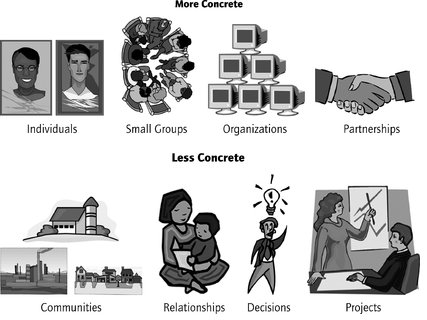
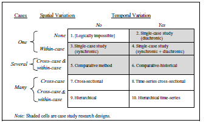
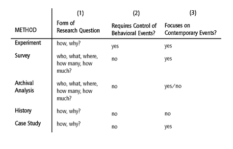
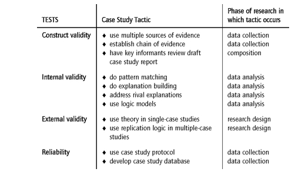
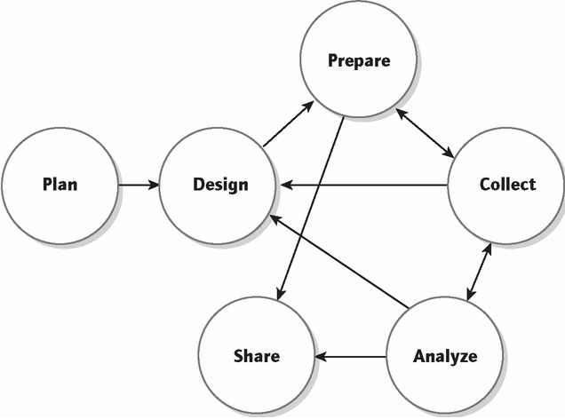
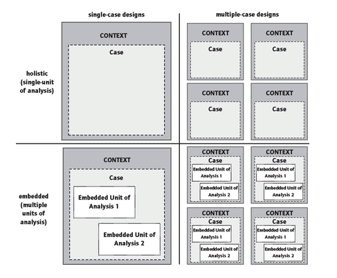

RMSS: Ninth Meeting 

Research Methodology in Social Sciences
========================================================
author: Dr. David Sichinava
date: November 27, 2018
autosize: true
transition: none
css: css/style.css
font-family: 'BPG_upper'
Ninth Meeting

Today's plan
========================================================
incremental: true

- Lecture:
	+ Case study research

Case study - what is it about? (Gerrig, 2006)
========================================================
- method is qualitative,
- the research is holistic, thick (a more or less comprehensive examination of a phenomenon)
- utilizes a particular type of evidence (e.g., ethnographic, clinical, nonexperimental, non-survey-based, participant-observation, process-tracing, historical, textual, or field research),3 (d) that its method of evidence gathering is naturalistic (a “real-life context”),4 (e) that the topic is diffuse (case
and context are difficult to distinguish)
- it employs triangulation (“multiple sources of evidence”)
- the research investigates the properties of a single observation 
- the research investigates the properties of a single phenomenon, instance, or example.

Case study - what is it about? (Gerrig, 2006)
========================================================
Case connotes a spatially delimited phenomenon (a unit) observed at a single point in time or over some period of time
	+ It's about a phenomenon having a _spatially and temporarily delimited boundaries_

Case study - what is it about? (Gerrig, 2006)
========================================================
+ Case study is an intensive study of a particular _case_
+ Case study research might be comprised with _several cases_
+ When several cases are involved, it's a cross-case examination of a phenomenon

Elements of case study research
========================================================
+ Observation, variables, sample

Elements of case study research
========================================================

What should we study?
========================================================

Covariational case study
========================================================

When to use case study research
========================================================

How should we select cases?
========================================================
+ Think about multiple cases from which you could select the most illuminating case
+ What is the unit of analysis?

What should you consider when designing a case study?
========================================================

What are the types of case study deigns?
========================================================

====================================

