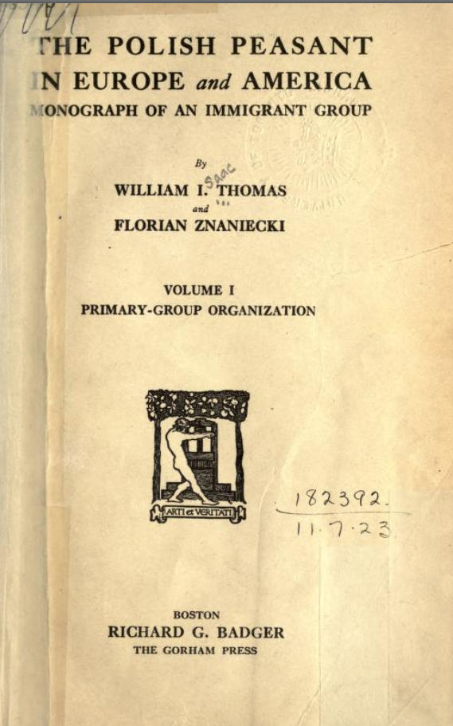
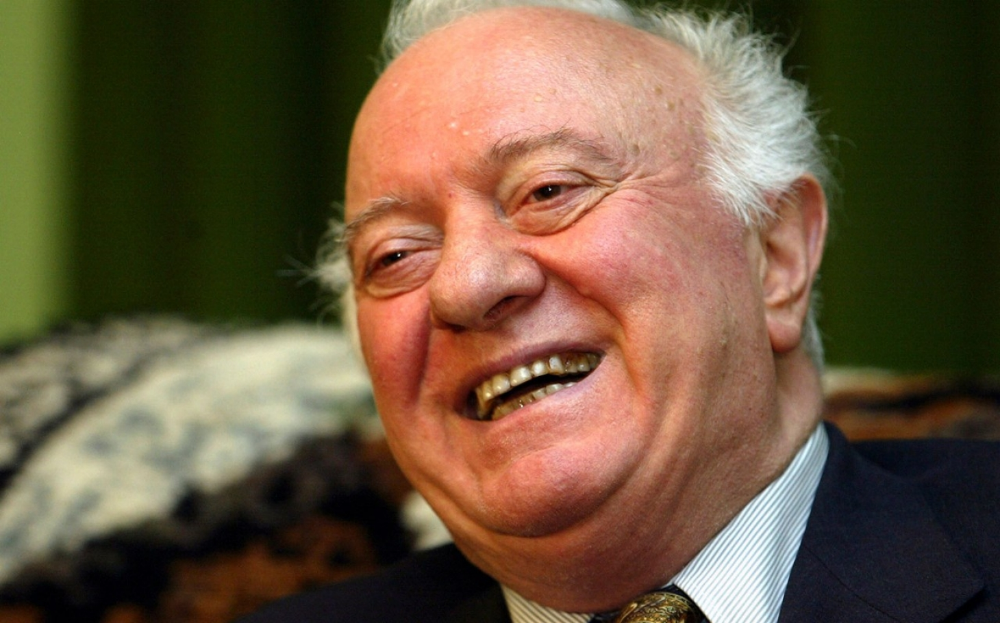

RMSS: First Meeting 

Research Methodology in Social Sciences
========================================================
author: Dr. David Sichinava
date: September 8, 2018
autosize: true
transition: none
css: css/style.css
font-family: 'BPG_upper'
First Meeting

Today's plan
========================================================
incremental: true

- Lecture:
	+ Science, Theory, Knowledge, and... Black Swans: Revisited
	+ Two paradigms in social research
	+ Ethics in social research

Recap: epistemology
========================================================

| **Positivism**                                                            | **Interpretativism**                                                                                  |
|----------------------------------------------------------------------------|------------------------------------------------------------------------------------------------------|
| General laws of human behavior                                 | Study informants' in in-depth and empathic manner                    |
| Social sciences should use similar methods to natural science | As we study our subjects through their viewpoint, the logic of natural sciences are not useful |
| Human behavior can be explained through general laws | As humans are complex subjects, it is impossible to derive general laws |

Quantitative versus Qualitative
========================================================

|			 | **Quantitative**                                                            | **თვისებრივი**                                                                                  |
|------------|----------------------------------------------------------------------------|------------------------------------------------------------------------------------------------------|
| The role of theory| Deductivism: theory testing | Inductivism: theory generation |
| Epistemology:| Similar to social sciences, that is *positivism(s) | Interpreativism |

Qualitative research
========================================================

Qualitative research
========================================================

* Social life should be studied in an in-depth manner

* The rolse of natural environment

* The role of **understanding** and **interpreting** the phenomenon

Qualitative research
========================================================

* Interviewing

* Focus groups

* Observation

* Case study

Theory of qualitative research: symbolic interactionalism
========================================================

* People give meanings to the phenomena and act according to these emanings

* Meanings form through social interaction

* Social action depends on the process of interpretation

* The meaning of things change over the process of interpretation

Blumer, 1969

The history of qualitative research
========================================================

Quantitative research
========================================================

Quantitative research
========================================================

* Studies the phenomenon in quantitative manner, that is _how much/how many_

* Decribes and unveils associations and causal relations
	+ Causality vs. correlation

* Social reality can be understood through general laws which are measurable

Quantitative research
========================================================

* Opinion polls 

* Randomized experiments

* Census

* Big data

Quantitative research
========================================================

Ethics in social research
========================================================

Experiment on obedience to authorities
========================================================

Stanford prison experiment
========================================================

Tuskegee syphillis study
========================================================

Informed consent
========================================================
+ Voluntary Participation
+ No Harm to the Participants
+ Anonymity and Confi dentiality
+ Deception
+ Analysis and Reporting
+ Institutional Review Boards
+ Professional Codes of Ethics

Research ethics and fabricating results: Lacour and Greene, 2015
========================================================
LaCour, M. & Green, D (2014): _When contact changes minds: An experiment on transmission of support for gay equality_,  http://science.sciencemag.org/content/346/6215/1366

Brookman, D., Kalla, J., Aronow, P. (2014): _Irregularities in LaCour (2014)_, 	http://stanford.edu/~dbroock/broockman_kalla_aronow_lg_irregularities.pdf

Plagiarism:
========================================================

წყარო: Citron, D., Ginsparg, P. (2014): _Patterns of Text Reuse in a Scientific Corpus_

====================================

