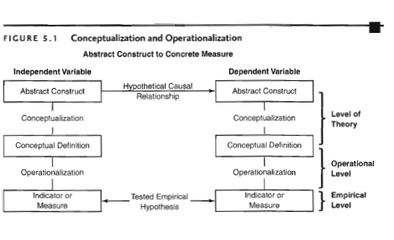

RMSS: Fourth Meeting 

Research Methodology in Social Sciences
========================================================
author: Dr. David Sichinava
date: September 25-29, 2018
autosize: true
transition: none
css: css/style.css
font-family: 'BPG_upper'
Fourth Meeting

Today's plan
========================================================
incremental: true

- Lecture:
	+ Conceptualization and Operationalization

Some reading time
========================================================
* Let's think about democracy
	- What do these authors think democracy entails?

Measuring what?
========================================================
* Concepts, conceptions, and reality

CONCEPTualization
========================================================
* What is a concept?
	* Directly observed;
	* Indirectly observed;
	* Constructs
* What kind of concept is democracy?	

Conceptualization
========================================================
* Rather process than fact
* Carefully thinking about the meaning of a concept
	- Theoretical foundations, anyone?
	
Conceptualization
========================================================
* Qualitative versus quantitative research
*  Qualitative conceptualization:
	* Remember, that you might think about concepts _when collecting your data_
	* Throughout the research, you are _attaching meanings_ to the concepts and trying to establish relationshipt between these ideas.

Conceptualization
========================================================
* Quantitative conceptualization:

Conceptualization
========================================================
* Dependent variable, independent variable, hypothetical relationship
* Indicators and dimensions

Operationalization
========================================================
* How do we apply specific measures to concepts
* Conceptual order
	* Conceptualization
	* Nominal definition
	* Operational definition
	* Measurement
	

====================================

