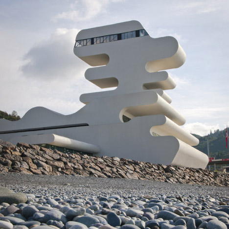
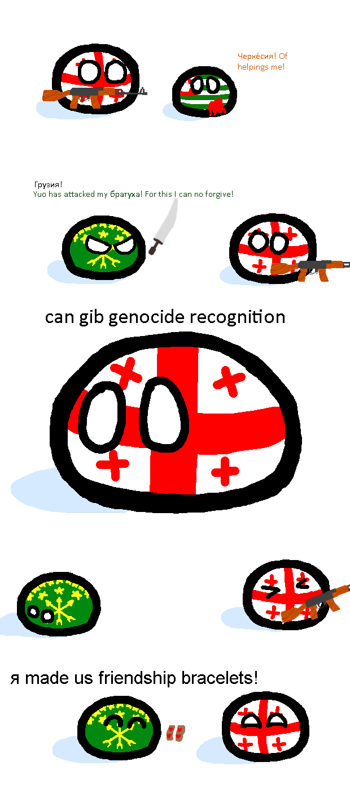

RMSS: Eighth Meeting 

Research Methodology in Social Sciences
========================================================
author: Dr. David Sichinava
date: November 17, 2018
autosize: true
transition: none
css: css/style.css
font-family: 'BPG_upper'
Eighth Meeting

Today's plan
========================================================
incremental: true

- Lecture:
	+ Language and Discourses 

What does it mean to analyze discourse?
========================================================
* Humans tend to _categorize_ their sensory impressions of the outside world.
* Perceptions are mediated through established social norms, or modes (say esthetics, morals, sexuality, established power structures, institutions, etc.)
* The representation of these _meanings_ are mediated through _language_ or _text_
* Discourses often contain mainstream representation of reality, which might be helpful to study _hegemonic_ power

What does it mean to analyze discourse?
========================================================
> "Georgia was a failed country. You cannot make a failed country through Scandinavian methods, overnight, something like Sweden or Norway".

> "My reforms survived my presidency ... most of it is still there, so from that standpoint: public services, absence of corruption, safety, I left a good legacy and a legacy that is still intact."

Texts, signs, and discourses
========================================================
> "Georgia has a very rich history in architecture but it's in a period of change right now"

> "Nothing really happened after the Soviet regime and architecture works quite well to show there's a certain reach towards modernisation and a transformation of the country, also connecting the country to the West... These projects are a very visible sign to show that there's a change going on."

Texts, signs, and discourses
========================================================

Texts, signs, and discourses
========================================================
> "Georgia has a very rich history in architecture but it's in a period of change right now"

> "Nothing really happened after the Soviet regime and architecture works quite well to show there's a certain reach towards modernisation and a transformation of the country, also connecting the country to the West... These projects are a very visible sign to show that there's a change going on."

Mapping representation
========================================================

Cultural competence
========================================================
* Familiarity with general social and political setting
	+ _Home blindness_

Delimiting texts
========================================================
* Which texts?
	+ Depends on what we are studying
	+ It is rarely possible to do an _exhaustive_ survey of texts
* Theory-driven, utilitarian, ludic (spontaneous) choices
* When selecting texts for analysis, always think what might be missing
	+ If you are studing conflicts (and politics are inherently about _conflicts_), some texts might be censored, or unpublished

Delimiting texts
========================================================
* Texts which are created in _anchor poitns_ of history
	+ _Canonical texts_, or _monuments_
* Texts which are systematically overlooked
	+ Writings by women, minorities

Mapping representation
========================================================
* How uncertain or challengeable are representations?
	+ The role of fringe narratives
* As meanings might be infinite, discourse analysis tries to define dominant positions and discuss other representations relative to it
	+ Self-censorship
	+ Media narratives

Layering discourses
========================================================
* Not all discourses are long-lasting, therefore one of the goal of analysis should be to demonstrate this fluidity

Discourse analysis - a practical toolkit
========================================================
* Consider the _context_ in which specific texts occur, or how they are _carved out from a social world_
* Think about other _signs_ which might be analyze on par with a particular text (e.g. architectural forms and speeches of former president)

Types of discourse analysis (after McDonald)
========================================================
* Descriptive - looks at the language as a system and tries to explain how various contexts affect the usage of particular language
* Critical discourse analysis - looks at _meanings_ as socially and politically constructed products

Levels of discourse
========================================================
* Vocabulary
* Grammar
* Genre
* Intertextuality
* Discursive formation
* Culture

Vocabulary
========================================================
* Semantic fields - words that are in some mutual meaning relation with one another
* Collocation
* Punctuation (italicization, highlighting, underlining)
* The use of pronouns

Grammar
========================================================
* Voice (might be challenging for some non-native speakers)
* Nominalization
* Tense (highlights the validity clame of a subject)
	+ Scientific and opinionated facts
* Process types
	+ Material
	+ Behavioral
	+ Mental

Genre
========================================================
* Genres have specific forms and meanings encoding the functions and meanings of social occasions
* They help providing a particular _context_ to the text

Genre and register
========================================================
* Usually, genre is communicated through linguistic _register_, which denotes a particular set of _words_ used in a particular context:
	+ What is being talked about,
	+ Who are involved in communication,
	+ What is the function of the language (written? spoken?)
	
Intertextuality
========================================================
* How contemporary texts are informed/how they _amalgamate_ past texts
* Text as a "trace of the process of production"
* Discoursive formation

====================================

